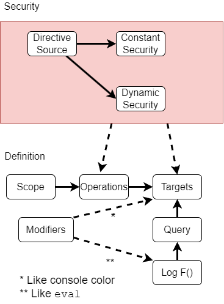

# Architecture

Per scope relation of directives:



- **Security**: What directives are a must, allowed or blocked, like blocking HTTP configs from `bad-domain.com`
  - _Dynamic_: can be changed upon receiving a new config, see below.
- **Scope**: Like a log tag in Android, the task or job currently writing the log. To become runtime filters to get the latest configured logger. Helps apply configurations to scope patterns such as `*.myjob.*.childX` or for all scopes with the keyword `all`.
- **Operations**: Per scope, where to get configuration (HTTP URL, Headers, etc.) and other logging configurations that are unrelated to the data logged inside
- **Targets**: Per the scope, where to log, and how (HTTP Headers, File path etc.)
- **Modifiers**: Added functionality to enrich data inside or make it better viewed in the target. Like `eval` local variables or printing with console colors.
  - Sub types: `Content`, `Runtime` and `Targets`
- **Query**: Functionality to reduce logs count like logging only the first 5 times inside a loop. Or using `random=0.XX` to get a percent of all running instances.

Each block has defaults if not specified. And also a default logger with all default blocks for unspecified scopes.

Security directives have no scope. They are applied to all scopes. They get replaced if changed. Like if the Env changed. See below for exceptions.

# Security vs Update Priority

When asking where to look for configuration for creation or update, what goes first and last, and which place is more secure, we consider the following:

| Order | Place          | Best Use Case      | Update Priority    | Security           |
| ----- | -------------- | ------------------ | ------------------ | ------------------ |
| (0)   | CLI Flags      | Security Enforce   | Only on start      | Always, Adds       |
| (1)   | JS Read-Only   | Web Prod           | Only on start      | Always, Adds       |
| (2)   | JS Cookie      | Web (Dev)          | If found, Replaced | If found, Replaced |
| (3)   | Process ENV    | FaaS (Lambda)      | If found, Replaced | If found, Replaced |
| (4)   | HTTPS JSON     | K8s Prod           | If found, Replaced | Always, Adds       |
| (5)   | File in `/tmp` | SSH / K8s / Docker | If found, Replaced | If found, Replaced |

## How to read the table?

Some examples:

- Because CLI always adds to security, given you use a security directive in a CLI flag, it will always apply, even if overwritten by a JS cookie or a local file in `/tmp`
- Because HTTP JSON is checked after the JS cookie, If a definition for a scope exists both in the JS cookie and in HTTP JSON, the JS cookie will be replaced by the latter.
- Any CLI directive that has no security considerations, will be ignored by any other definitions found.

## Definitions and Considerations:

0. **CLI Flags** - The most "close to code" you can get. If you can change those, you already control the code. So it will be the last line of security defense. On the other hand, it is also very hard to change without redeploying, so it will be replaced by any other definition.

1. **JS Read-Only** - Using JS at the top of the HTML page, you can create a read-only object. Which is like the CLI params in other env. This will make sure no 3rd party code can override any security definitions.

Example code for setting a read-only `window.XYZ`:

```js
Object.defineProperty(window, "XYZ", {
  enumarable: false,
  configurable: false,
  get: () => "<DEFENTITION HERE>",
  set: (x) => console.error("XWLoggerSecurity Already defined!"),
});
```

2. **JS Cookie** - In a web browser, you can update definitions using the cookie, either from a server with the `Set-Cookie` header or inside the page with JS code (`HttpOnly` cookies are not supported, since you can't read them from the JS).

3. **Process ENV** - The logger will also look for updated definitions in the Env. Env is sometimes as static as CLI params and needs a redeploy to change, but sometimes not, like in FaaS. In AWS, changing Env of a Lambda is 2 click process, and could use this to update. We don't apply this always security-wise as it is more prone to variations in deployment and maybe a big DevOps burden. Use CLI or JS Read-Only for security purposes.

4. **HTTPS JSON** A JSON HTTPS URL with the definitions. Can be a static file or generated based on request. It will always add to the security because we see it as the way DevOps control large deployments. But it will be overridden by local definitions to allow debugging in specific cases.

5. **File in `/tmp`** - Mostly for scenarios of a running process without the ability to change the CLI params and the Env. Like running docker containers, K8s pods and VM processes. It will override scopes in the HTTPS JSON since we guess you have more priority. As the HTTPS JSON is intended to be more prod oriented, and apply to a lot of processes at once.
